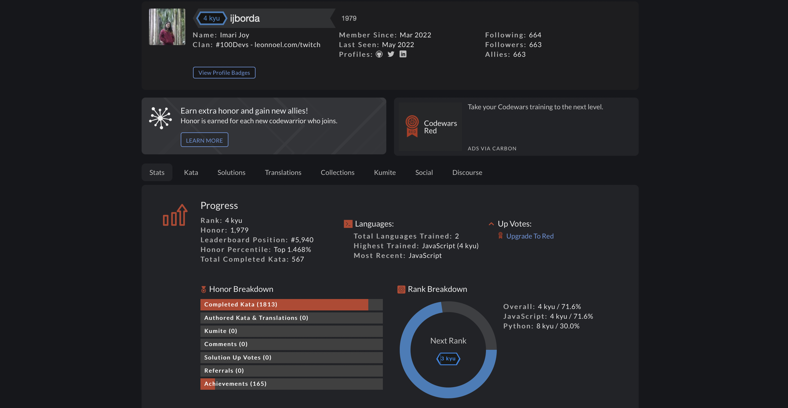

# 💪 My Daily Coding Challenges (Codewars)

A repository filled with my daily codewars challenges (kata). Currently ranked #4,525 on the global leaderboard. Completed over 500+ problems.

I'm into JavaScript right now, and I plan to finish all JS katas!

What is codewars? Visit them [here](https://www.codewars.com)!

Link to my codewars profile: [https://www.codewars.com/users/ijborda](https://www.codewars.com/users/ijborda)



## How To Use
The repository is divided into different kyus. Inside each kyus, there are multiple js files. One js file is one kata. I take note of the title of the kata, my solution, and some test cases. Ocassionally, I also note other's solution that I find interesting. I commit to the repository daily. On average, I do 5 katas per day.  

## How It's Made
Tech used: Bash, JavaScript, and Node.

I used bash to pre-populate the kyu folders with js files. Below is the command I used. Be sure to navigate first on the desired folder before using it. Also change the numbers inside `{}` depending on how many js files you want to create. The example below would create 1000 js files with filenames from `0000.js` to `1000.js`
```
for i in {0000..1000}
do
    touch ${i}.js
done
```

## My Progress
* 8 kyu: 390/390 ✅
* 7 kyu: 160/1899
* 6 kyu: 51/1980
* 5 kyu: 1/814
* 4 kyu: 0/269
* 3 kyu: 0/71
* 2 kyu: 0/40
* 1 kyu: 0/22

## Thanks for checking it out! 

Check out my other projects:

* [Codie | See your Codewars Stats at a Glance](https://github.com/ijborda/codie)
* [Daily Inspiration | Start your Day Inspired](https://github.com/ijborda/daily-inspiration)
* [COVID-19 Statistics | A COVID-19 Monitoring App](https://github.com/ijborda/covid19-statistics)